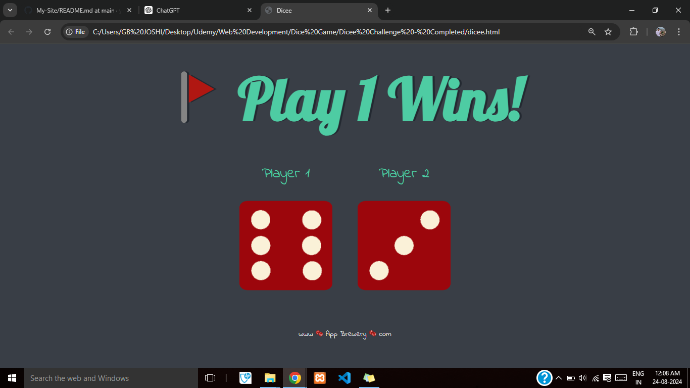
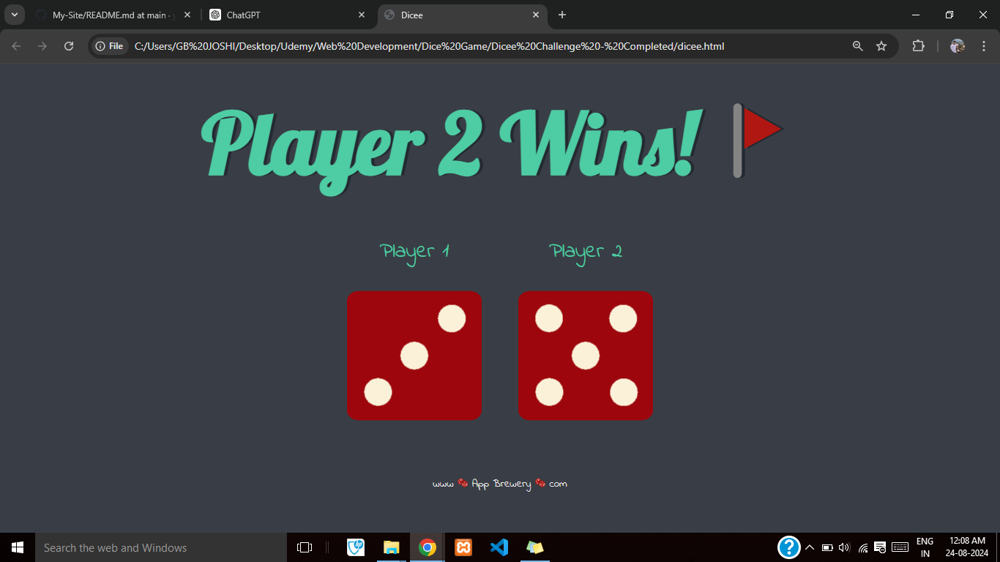
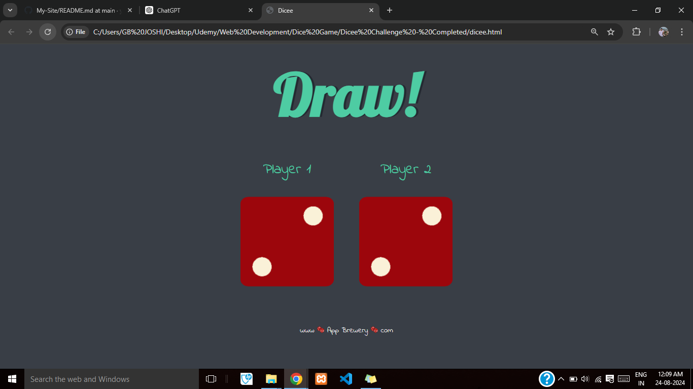

# Dice-Game - The "Dice Game" is an engaging and interactive online game designed to bring the classic fun of rolling dice to a digital platform. 
Ideal for casual players and enthusiasts alike, this project allows users to experience the thrill of chance and strategy with a simple yet addictive gameplay mechanic.

# Instructions - 

Features:

Customizable Dice Rolls: Users can roll one or multiple dice with adjustable sides (e.g., 6-sided, 10-sided, 20-sided) to fit different game scenarios or preferences.
Game Modes: Various modes such as single-player, multiplayer, or competitive challenges to suit different playstyles and social interactions.
Score Tracking: Automatic scorekeeping to record results of each roll, track high scores, and maintain game history.
Rules and Instructions: Built-in guidelines and tips for common dice games or user-defined rulesets, making it easy for beginners and experienced players to get started.
Interactive Design: A user-friendly interface with engaging visuals and sound effects to enhance the gaming experience.
Statistics and Analytics: Detailed statistics on dice rolls, including frequency, averages, and probabilities to provide insights and strategies.

## Screenshots:
### 1- Screenshot-1

### 2- Screenshot-2

### 3- Screenshot-3

### 4- Screenshot-4

### Links

- Solution URL:  [Solution  URL](https://github.com/yashgjoshi20/Dice-Game.git)
- Live Site URL: [GitHub Pages Live URL](https://yashgjoshi20.github.io/Dice-Game/)

### Built with

- Semantic HTML5 markup
- CSS custom properties
- Flexbox
- CSS Grid
- Mobile-first workflow

For the website I've used the following resources:
* ***Icons***: [FlatIcons](https://www.flaticon.com/)
* ***Fonts***: [GoogleFonts](https://fonts.google.com/)
* ***Bootstrap***: [Bootstrap](https://getbootstrap.com/)
* ***External Packagers***: [NPM](https://www.npmjs.com/)

 ## Author

- GitHub - Yash Joshi (https://github.com/yashgjoshi20)
